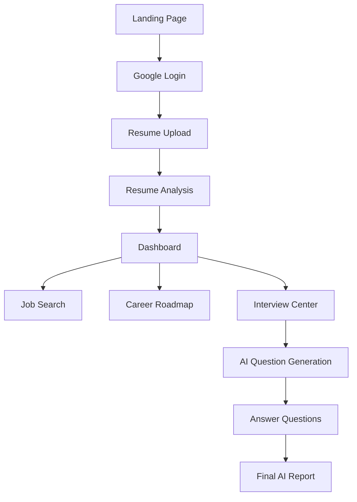
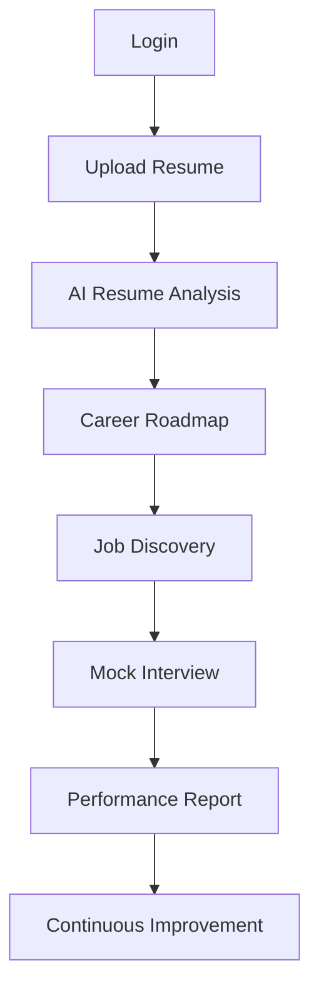

# 🚀 PrepMate AI Frontend

<div align="center">
  <p><strong>A modern AI-powered career preparation platform.</strong></p>
</div>

---

## 🌟 Overview
PrepMate AI Frontend helps users:
- 📄 **Upload and analyze resumes**
- 🗺️ Generate **personalized career roadmaps**
- 🔍 **Discover** relevant job opportunities
- 🤖 Practice **AI-generated mock interviews**
- 📊 Receive **detailed interview performance reports**
- 📈 Track **interview history and progress**

Built with a modern React-based architecture and integrated with the PrepMate AI backend. The platform provides a complete interview preparation experience from resume upload to final interview evaluation.

> **🚀 Made With Antigravity**  
> This frontend was designed and developed using Antigravity, enabling rapid UI development, component generation, workflow acceleration, and modern frontend engineering practices.

---

## ✨ Features

### 📄 Resume Upload & Analysis
- **Drag-and-drop** PDF upload
- Resume processing workflow
- **AI-powered resume analysis**
- Career profile generation
- Skill extraction and evaluation  
*(Users can upload PDF resumes and select their target position before analysis begins.)*

### 🗺️ AI Career Roadmap
Generate personalized learning roadmaps based on:
- Current skills & Skill gaps
- Resume analysis
- Target role

*The platform provides a structured month-by-month learning path.*

### 🔍 Smart Job Search
- **AI-assisted job discovery**
- Resume-aware recommendations
- Job description matching
- Opportunity ranking

### 🎤 AI Mock Interviews
Supports **Technical** and **HR** interviews.
- **Features**: Topic-based interviews, Difficulty selection (Easy, Medium, Hard), Dynamic question generation, Interactive Q&A sessions, Resume-aware questioning.

### 📊 Interview Reports
After interview completion users receive:
- Final score
- Strength & Weakness analysis
- Detailed feedback & Improvement recommendations
- Interview transcript

### 📚 Interview History
- View previous interviews
- Resume active interviews
- Access past reports
- Track progress over time

---

## 🛠️ Tech Stack

<div align="center">
  
  
  
  
</div>
<br/>

| Category | Technologies |
| --- | --- |
| **Frontend** | React, React Router, Axios, Tailwind CSS, React Hot Toast |
| **API Communication** | REST APIs, JWT Authentication, Google OAuth Integration |

*(Connected to the PrepMate AI FastAPI backend.)*

---

## 🔄 Application Flow



---

## 📑 Pages

### Landing Page
- Product introduction & Feature showcase
- Call-to-action sections
- Google Sign-In

### Onboarding
- Target role selection
- Resume upload & Processing animation
- AI profile generation

### Dashboard
Provides access to:
- Resume insights & Career roadmap
- Job search & Interview preparation

### Interview Center
- Create interview (Select topic & difficulty)
- Start interview session
- View reports & Interview history

---

## 📂 Project Structure
```text
src/
├── api/
├── components/
│   ├── landing/
│   ├── interview/
│   ├── dashboard/
│   ├── roadmap/
│   └── ui/
├── pages/
├── hooks/
├── context/
├── routes/
└── assets/
```

---

## ⚙️ Environment Variables

Create a `.env` file in the root directory:
```env
VITE_API_URL=http://localhost:8000
VITE_GOOGLE_CLIENT_ID=
VITE_APP_NAME=PrepMate
```

---

## 💻 Local Development

1. **Clone the repository**
   ```bash
   git clone <repository-url>
   cd frontend
   ```

2. **Install dependencies**
   ```bash
   npm install  # or pnpm install
   ```

3. **Run Development Server**
   ```bash
   npm run dev  # or pnpm dev
   ```
   *Application runs at: http://localhost:5173*

4. **Build For Production**
   ```bash
   npm run build
   npm run preview
   ```

*(Requires the PrepMate AI Backend running on `http://localhost:8000`)*

---

## 🚀 Core User Journey


---

## ✨ Future Enhancements
- [ ] Voice-based interviews
- [ ] Real-time AI interviewer
- [ ] Interview analytics dashboard
- [ ] Multi-language support
- [ ] Dark/Light theme switching
- [ ] Company-specific interview preparation
- [ ] AI resume optimization

---

## 👨‍💻 Author
**Shubham Acharya**

**PrepMate AI**  
*AI-Powered Interview Copilot & Career Preparation Platform*

<br/>
<div align="center">
  
</div>
